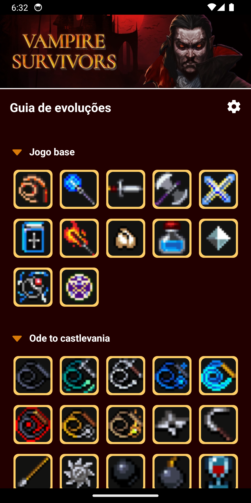
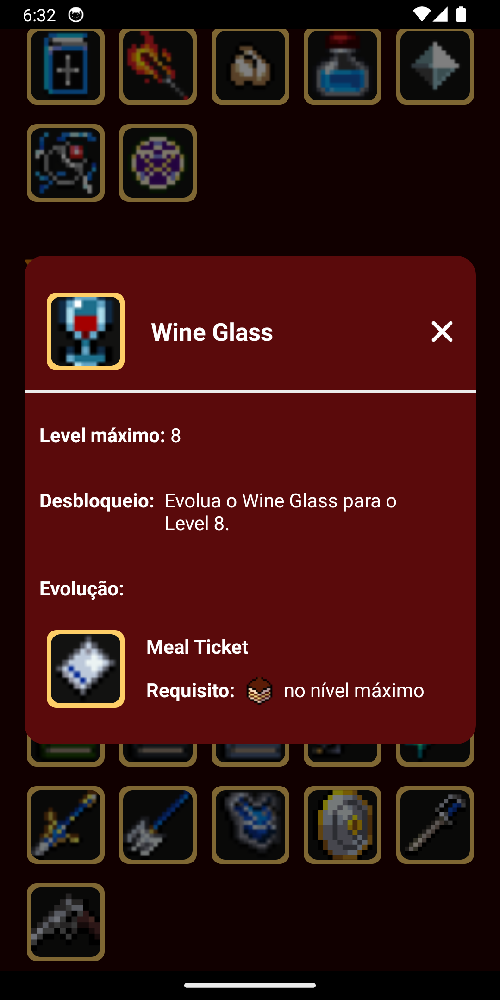

<h1 align="center">VS Weapons Guide</h1>

<p align="center">
  <strong>Versão 1.0.1</strong>
</p>

<p align="center">
  
  
</p>

---

Um guia ilustrado para o jogo “Vampire Survivors”, com um catalogo de como obter e evoluir todas as armas do jogo base e do dlc “Ode To Castlevania”. O app apresenta visão detalhada para cada arma e suporte a troca de idioma entre português e inglês. O conteudo descritivo é retirado da wiki pública do jogo: www.vampire-survivors.fandom.com/wiki/Vampire_Survivors_Wiki

## Screenshots

<table align="center">
  <tr>
    <td align="center">
      <br/>
    </td>
    <td align="center">
      <br/>
    </td>
  </tr>
</table>

## Requisitos

- React Native v0.76.9
- Expo v~52.0.49

## Instalação

1. Instale as dependencias

```bash
yarn install
```

2. Inicie o servidor do Expo:

```bash
npx expo start
```

3. Abra o aplicativo:
  - Leia o QR Code exibido no terminal com o app Expo Go no seu celular ou pressione 'a' para emulador Android
